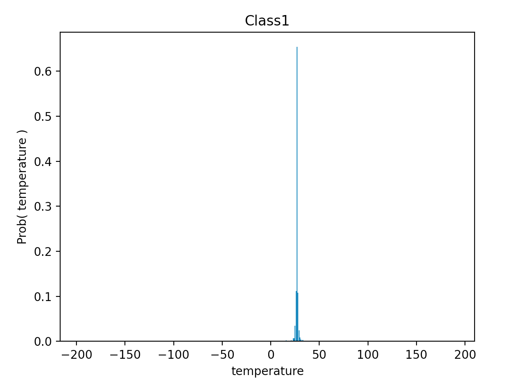
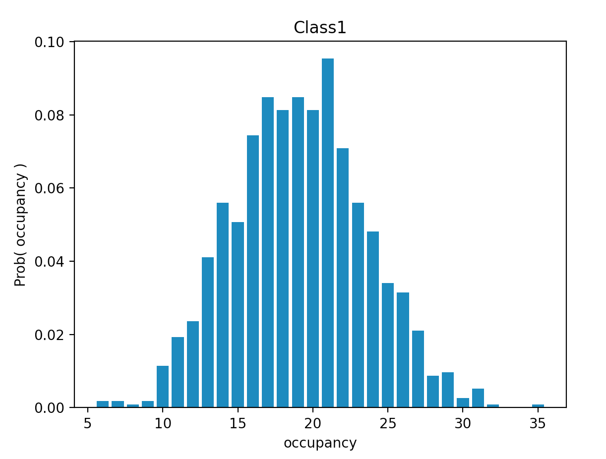
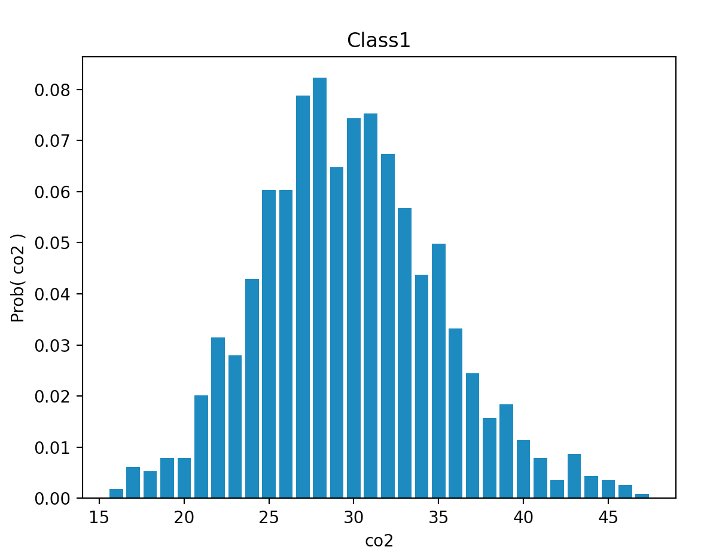
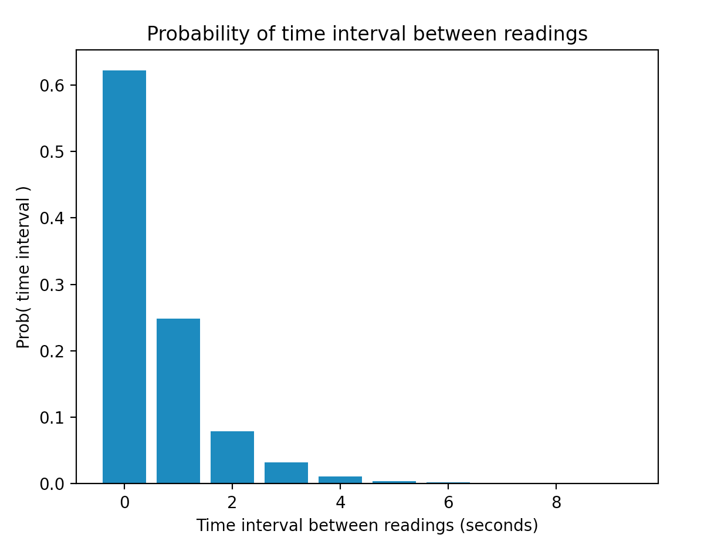

# Miniproject Report -- Anirudh Watturkar and Luisa Watkins

## Intro/Task 0

The purpose of this project is to simulate the data gathering and analysis process in a hardware system communicating with many sensors. The first step in accomplishing this was to set an environment capable of running python websockets and the given simulator code. Upon establishing a connection between the server and the client, the following greeting string is issued by the server to the client:

## Task 1

In this portion, we were tasked to implement File I/O to write the JSON data received by the client to a log file. To do this, we open the log file at the specified path, and each iteration that data is received, we write it to the log file after it is printed to the terminal. Upon receiving any exception, the file is closed. This program was then run for about 30 minutes to generate a sufficiently large dataset for analysis in the next task.

## Task 2

In this section we perform an analysis of the data we gathered in the previous part. The code for the analysis is in analyze.py, which reads in the JSON-formatted log file. We first started by familiarizing ourselves with the existing dictionary that stored the sensor data per each location. Then, we extracted the sensor data (temperature, occupancy, cO2) for each location, and got the summary statistics for each (mean, median, variance). We also plotted normalized histograms for each sensor and location to get a sense of the distribution of the data for each sensor type. For the purpose of this report, we have chosen to highlight the room 'class1':
1. From the observed temperature data for class1, the median is 26.9886685610252 and the variance is 141.80997816911497.
2. From the observed occupancy data for class1, the median is 19.0 and the variance is 19.350402127930156.
3. Temperature Sensor Histogram:

Occupancy Sensor Histogram:

CO2 Sensor Histogram:

4. For the time interval of the sensor readings, the mean is 0.5884198516828294 and the variance is 0.9193068585220546.

Yes, this time interval histogram does mimic a well-known distribution--the Erlang distribution. If we look at what happens within a time interval, we are focusing on how many sensor readings occur. Since this deals with the number of times an event occurs in an interval of time, this follows a Poisson distribution. Since the number of events that occur in a time period follows a Poisson, then the time between occurrences follows an Erlang distribution.

## Task 3

For this task, we took the temperature data from Task 2 and designed and implemented an algorithm to detect anomalies. This is since the temperature variance was larger than expected due to "bad" data values that are unrealistically large and small. We wrote a new function called detect_anomalies and used it within it analyze.py.
1. For the room 'class1', the percent of "bad" data points is 0.02187226596675415, the temperature median with these bad points discarded is 26.989418199038496, and the temperature variance with these bad points discarded is 1.5590970012176244.
2. In terms of persistent changes in temperature, there are multiple cases. If the temperature is persistently at a very different value from the rest of the distribution, then it depends; for example, if there is a fire then it makes sense for a persistent change to occur, but if there is no environmental difference and the temperature value is not within the bounds of common sense. On the other hand if the temperature is persistently changing and is jumping from one value to another very different value, then that most likely indicates a failed sensor. 
3. Possible bounds on temperature for 'office' are: 32.026650 and 16.859730. Possible bounds on temperature for 'class1' are: 37.560409 and 20.007925. Possible bounds on temperature for 'lab1' are: 24.269385 and 18.011436.

## Task 4 - Conclusions

This project served as a simulation of a hardware system that interacts with sensors, both in the aspect of gathering and analyzing data. Much like real-world systems, this simulation required collecting data routinely and storing the data for use in analysis. This also involved connecting a server and a client node for data communication. Though this was done through a locally hosted server on the same machine, this process would be very similar in the case where the server and the client were separate, since the actual data logging process would remain the same. In terms of analysis, this process was virtually the same as in the real-world, where you are given a large amount of data and you are trying to make sense of it.

Like many simulations, however, this also has limitations. For example, the data does not seem to have any dependence on the time it was collected. When gathering this data, you may expect that the each of the sensor readings would change during the night versus during the day as there would be less people in the building in the night, as well as lower ambient temperatures, leading to lower readings on each sensor. Another limitation is the number of rooms that the data is gathered from. The simulation only provides three room types, when in the real world, there would typically be more rooms that are being analyzed. With a larger number of rooms, the problem of gathering readings from many sources at once becomes more apparent, and would have to be accounted for in real-world system.

This introduces the idea of the server polling the sensors versus the sensors pushing to the server. In the case of polling, the server routinely flips between sensors and gets their readings. In the case of pushing, the sensors send a request (usually asynchronously) to the server to take their data.

The polling method works well for systems that need to consistently gather data, since it would regularly gather data from all sensors, but has the limitation that it may poll stale data from sensors that are not ready to be read yet. If sensors request the server wait until their data can be read, this can slow down the reading time for the server, and can even cause the server to wait indefinately if the sensor fails. On the other hand, if the server skips a sensor that is not ready to be read, the data will not be consistently gathered across all sensors, leading to potentially poor data collection. Also, if there are many sensors to poll, the data from other sensors may be stale by the time it is recorded by the server.

Conversely, the pushing method allows the server to only receive valid data from the sensors, as they send data to the server only when they are ready. This prevents the system from failing in the polling case, since the server will not be locked waiting for sensor data. Also, in the case of few sensors or very spaced out readings, the server can go into a powersaving/sleep mode to reduce power consumption. This, however introduces the new challenge of race conditions if mulitple sensors attempt to send data to the server at once.

For the purposes of this project, the 'best' method really depends on the intended use case. In its current state, it may be more advantageous to poll, since the sensors are read from often enough to limit the power comsumption benefits of sleeping offered by the other method, and there are not too many sensors that would delay readings from other sensors.

In terms of the difficulty of using the simulation tool, though neither us have used the c/c++ websockets tool, we found using the python based tool fairly intuitive after spending time using it. Even without using the c/c++ tool for websockets, it is very likely that the python version is easier to operate, at least syntatcially so.
